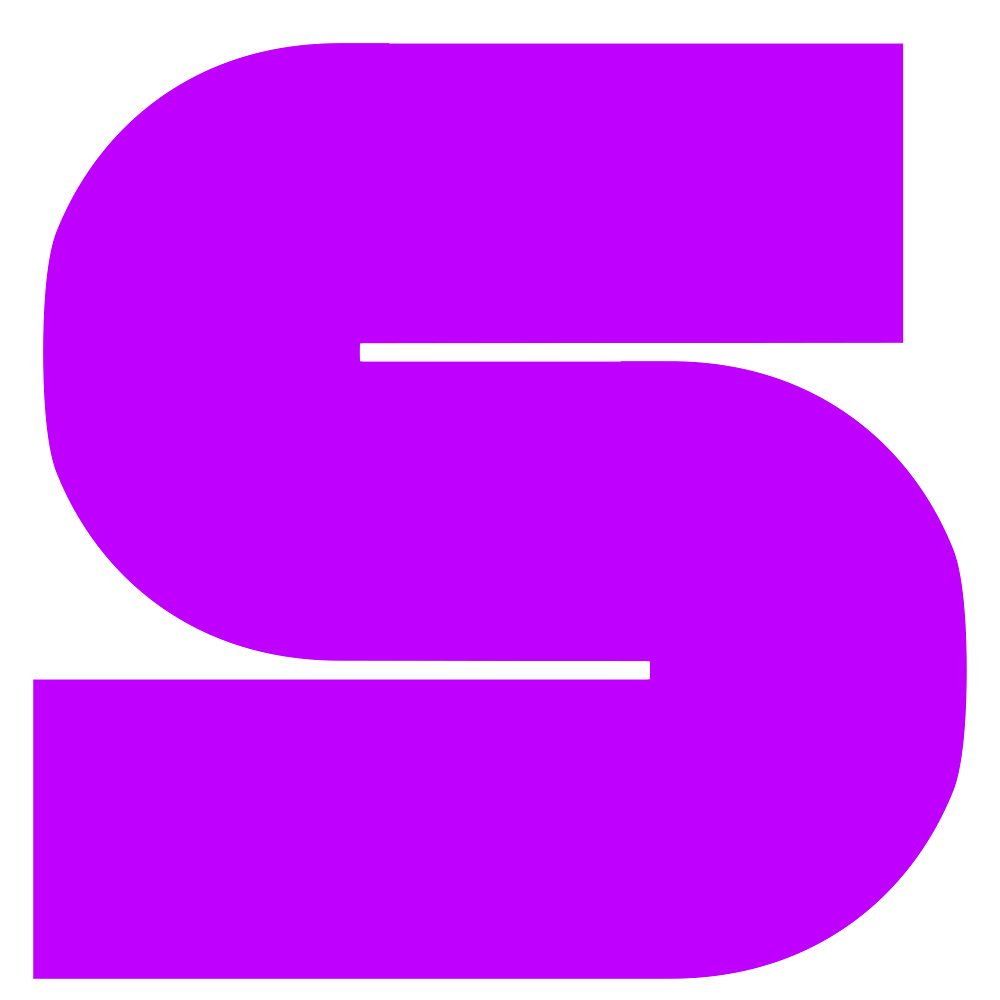

<p align="center">
  
</p>

<h1 align="center">StickyWeb</h1>

<p align="center">
  Add persistent sticky notes anywhere on the web.
</p>

StickyWeb is a lightweight Chrome extension that lets you place notes directly on webpages. Every note is stored locally and restored at the same document position when you reload or revisit the page.

The extension is built with Manifest V3 and vanilla JavaScript, HTML, and CSS. It has no framework, external runtime dependency, account requirement, analytics, or build step.

## Installation

StickyWeb is currently distributed as an unpacked Chrome extension.

1. Download : [StickyWeb v1.2.0.zip](https://github.com/user-attachments/files/31191293/StickyWeb.v1.2.0.zip)

2. Open `chrome://extensions` in Google Chrome.
3. Enable **Developer mode** in the upper-right corner.
4. Select **Load unpacked**.
5. Choose the folder containing `manifest.json`.
6. Pin StickyWeb from Chrome's Extensions menu for quick access.

After updating the source files, return to `chrome://extensions` and select **Reload** on the StickyWeb card. Refresh already-open webpages so Chrome can inject the updated content script.

## Features

- Create notes from the extension popup or keyboard shortcut.
- Place notes at document coordinates so they remain attached to the page while scrolling.
- Drag and resize notes without an external library.
- Write plain-text notes with automatic local persistence.
- Choose from six preset note colors.
- Minimize notes into compact page markers.
- Delete notes with confirmation.
- Keep note styles isolated from website CSS through Shadow DOM.
- Search all saved notes from the options page.
- Filter notes by website domain.
- Return to the original webpage from the note library.
- Export all notes as formatted JSON.
- View and edit the active Chrome shortcut.
- Use light and dark interface themes based on system preferences.


### Local files

To use StickyWeb on `file://` pages:

1. Open StickyWeb's details from `chrome://extensions`.
2. Enable **Allow access to file URLs**.
3. Reload the local page.

## Usage

### Add a note from the popup

1. Open a normal webpage.
2. Select the StickyWeb icon in the Chrome toolbar.
3. Select **Add Note**.
4. Write your note and move or resize it as needed.

The note is created at the center of the current viewport and saved using document coordinates.

### Use the keyboard shortcut

Press:

```text
Alt + Shift + S
```

The shortcut creates a note at the center of the current viewport.

To change it, select **Edit** in the StickyWeb popup or open:

```text
chrome://extensions/shortcuts
```

Chrome owns extension shortcut assignments, so shortcut changes are made through Chrome's official shortcut settings.

### Manage all notes

Select **View All Notes** in the popup to open the note library. From there you can:

- Search note text.
- Filter notes by website.
- Open the original webpage.
- Export all stored notes as JSON.

## URL normalization

StickyWeb stores notes under a normalized version of the current URL.

The normalizer:

- Preserves the protocol, hostname, path, and meaningful query parameters.
- Removes the URL fragment.
- Removes common tracking parameters such as `utm_*`, `gclid`, `fbclid`, and `msclkid`.
- Sorts remaining query parameters for consistent page matching.

For example:

```text
https://example.com/article?id=42&utm_source=newsletter#comments
```

becomes:

```text
https://example.com/article?id=42
```

## Storage

Notes are stored in `chrome.storage.local`, keyed by normalized page URL.

```json
{
  "https://example.com/article?id=42": [
    {
      "id": "b8ce7f41-0c07-4d48-952c-250fe2017620",
      "text": "Review this section later.",
      "x": 180,
      "y": 720,
      "width": 288,
      "height": 220,
      "color": "#fff3a3",
      "minimized": false,
      "createdAt": "2026-08-18T10:00:00.000Z",
      "updatedAt": "2026-08-18T10:05:00.000Z"
    }
  ]
}
```

Storage writes triggered by dragging, resizing, and typing are debounced to avoid writing on every pixel or keystroke.

## Permissions

StickyWeb requests only the permissions required for its current features.

| Permission | Purpose |
| --- | --- |
| `storage` | Saves notes and preferences in `chrome.storage.local`. |
| `activeTab` | Lets the popup identify the active page and request creation of a note after a direct user action. |
| `<all_urls>` content script access | Displays saved notes on supported webpages. |

Chrome does not allow content scripts on protected pages such as `chrome://` pages or the Chrome Web Store.

## Privacy

- Notes stay in your browser's local extension storage.
- StickyWeb does not require an account.
- StickyWeb does not send notes to an external server.
- StickyWeb does not include analytics, advertising, or tracking code.
- Exporting notes creates a local JSON download initiated by the user.

Because notes are stored locally, clearing extension data or removing the extension may delete them. Export important notes before resetting browser data.

## Project structure

```text
StickyWeb/
├── manifest.json
├── background.js
├── content.js
├── popup.html
├── popup.css
├── popup.js
├── options.html
├── options.js
├── README.md
└── icons/
    ├── logo.svg
    ├── icon16.png
    ├── icon48.png
    └── icon128.png
```

## Architecture

### `content.js`

Runs on supported webpages and owns the note lifecycle:

- URL normalization
- Shadow DOM rendering
- Note creation and restoration
- Dragging and resizing
- Color, minimize, and delete actions
- Debounced persistence
- Single-page application URL-change detection

Note coordinates are stored relative to the document rather than the viewport. This keeps notes in the correct page location after scrolling or reloading.

### `background.js`

Registers the Manifest V3 service worker and handles the `create-note` command. When the shortcut is used, it sends a message to the active tab's content script.

### Popup

`popup.html`, `popup.css`, and `popup.js` provide quick access to:

- Add a note on the current page.
- View the number of notes on the page.
- Open the complete note library.
- View or edit the current keyboard shortcut.

### Options page

`options.html` and `options.js` list notes across all stored URLs and provide text search, domain filtering, page links, and JSON export.

## Development

No package installation or compilation is required.

1. Clone the repository.
2. Make changes directly to the source files.
3. Open `chrome://extensions`.
4. Select **Reload** on StickyWeb.
5. Refresh the webpage used for testing.

The project intentionally uses browser APIs and vanilla JavaScript to keep the codebase easy to inspect and modify.

## Known limitations

- Notes cannot appear on protected Chrome pages.
- Local-file support must be enabled manually.
- Positions are tied to document coordinates. Major layout changes made by a website may alter the visual relationship between a note and the original content.
- Notes are stored per browser profile and do not sync between devices.
- Shortcut availability depends on Chrome and may conflict with another extension or system command.

## Contributing

Bug reports and focused pull requests are welcome.

When proposing a change:

1. Keep the extension compatible with Manifest V3.
2. Avoid introducing a build step unless the change clearly requires one.
3. Preserve Shadow DOM isolation for page UI.
4. Keep storage migrations backward-compatible.
5. Test note creation, reload persistence, dragging, resizing, minimization, deletion, popup actions, and options-page filtering.

## Credits

- Interface icons are based on [Heroicons](https://heroicons.com/).
- StickyWeb is built with standard Chrome Extension APIs.


